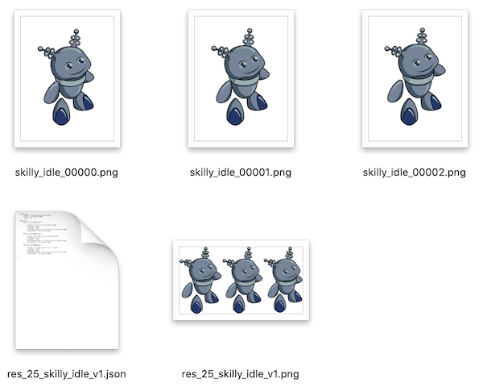

Sprite sheets is one of many forms of [graphics](UI.md) supported by the [Freecode creator](Freecode_creator.md).
Here we will explore what sprite sheets are and how they can be created for use on Futureskill.


## Sprite sheets

A sprite sheet is an image containing many individual images.
The sheet must be complemented with an image atlas object that contains the information of where in the sheet sheet each individual image sprite can be found and what animations the images are used for.

Sprite sheets compatible with the Futureskill platform require that each individual image is exactly the same size in each sprite sheet.
If they are not the same size the images will stretch to accomodate the size defined for the sprite_sheet element in the implementation code.

The Sprite sheet atlas must be a JSON compatible with the PIXI.js framework.
A free tool that can be used to generate sprite sheets from individual sprite images is [spritesheet.js](https://github.com/krzysztof-o/spritesheet.js).


## Using spritesheet.js

Each sprite image must be in the same folder and have the same name, except for a number that should indicate which animation fram that image is.
If we have a number of images of skilly being idle that we want to turn into an animation then they could be named `skilly_idle_00000.png` where the number in the name increases for each fram of animation.

If we want to turn the skilly_idle_\*.png images into a sprite sheet we can run the command:
```
spritesheet-js -f pixie.js -n skilly_idle_v1 skilly_idle_\*.png
```
Which will create the files `skilly_idle_v1.png` and `skilly_idle_v1.json`, where the png is the sprite sheet image and the json is the image atlas containing information about where each sprite is in the sheet.

The command above will not remove any white space or compress the image in any way.
If we want to remove unnecessary whitespace and compress the image to 25% we can instead run the command:
```
spritesheet-js -f pixie.js --scale 25% --trim -n res_25_skilly_idle_v1
skilly_idle_\*.png
```
Which will create the image `res_25_skilly_idle_v1.png` and the atlas `res_25_skilly_idle_v1.json`.
A limited example of this can be seen below where a sheet was created with only 3 images.
Normally there will be many more in order to create a smooth animation.

{ loading=lazy }

## Atlas example

The 3 image example above resulted in the following image atlas:

``` 
{
  "meta": {
    "image": "res_25_skilly_idle_v1.png",
    "size": {"w":363,"h":198},
    "scale": "1"
  },
  "frames": {
    "skilly_idle_00002.png":
    {
      "frame": {"x":0,"y":0,"w":126,"h":198},
      "rotated": false,
      "trimmed": true,
      "spriteSourceSize": {"x":31,"y":22,"w":126,"h":198},
      "sourceSize": {"w":188,"h":250}
    },
    "skilly_idle_00001.png":
    {
      "frame": {"x":126,"y":0,"w":120,"h":197},
      "rotated": false,
      "trimmed": true,
      "spriteSourceSize": {"x":33,"y":23,"w":120,"h":197},
      "sourceSize": {"w":188,"h":250}
    },
    "skilly_idle_00000.png":
    {
      "frame":{"x":246,"y":0,"w":117,"h":195},
      "rotated":false,
      "trimmed":true,
      "spriteSourceSize":{"x":33,"y":25,"w":117,"h":195},
      "sourceSize":{"w":188,"h":250}
    }
  }
}
```

## Define animations

The image atlas created by `spritesheet.js` will not contain any animations.
When uploading the sheet in the freecode creator you also have to uplad the image atlas.
While doing this it is possible to use a "Generate Animation" button that will create a "default" animation iterating over all the images in the sheet orderd by their individual image number from the individual image names.
The animations are added as a list of frames in the image atlas.
To add additional animations from the same sheet just add another list element in the image atlas and the key associated with the list will be that animations name.

The 3 image example above resulted in the following image atlas after the image was uploaded to Futureskill and a default animation was generated:
```
{
  "meta": {
    "image": "res_25_skilly_idle_v1.png",
    "size": {
      "w": 363,
      "h": 198
    },
    "scale": "1"
  },
  "frames": {
    "skilly_idle_00002_png": {
      "frame": {
        "x": 0,
        "y": 0,
        "w": 126,
        "h": 198
      },
      "rotated": false,
      "trimmed": true,
      "spriteSourceSize": {
        "x": 31,
        "y": 22,
        "w": 126,
        "h": 198
      },
      "sourceSize": {
        "w": 188,
        "h": 250
      }
    },
    "skilly_idle_00001_png": {
      "frame": {
        "x": 126,
        "y": 0,
        "w": 120,
        "h": 197
      },
      "rotated": false,
      "trimmed": true,
      "spriteSourceSize": {
        "x": 33,
        "y": 23,
        "w": 120,
        "h": 197
      },
      "sourceSize": {
        "w": 188,
        "h": 250
      }
    },
    "skilly_idle_00000_png": {
      "frame": {
        "x": 246,
        "y": 0,
        "w": 117,
        "h": 195
      },
      "rotated": false,
      "trimmed": true,
      "spriteSourceSize": {
        "x": 33,
        "y": 25,
        "w": 117,
        "h": 195
      },
      "sourceSize": {
        "w": 188,
        "h": 250
      }
    }
  },
  "animations": {
    "default": [
      "skilly_idle_00000_png",
      "skilly_idle_00001_png",
      "skilly_idle_00002_png"
    ]
  }
}
```
